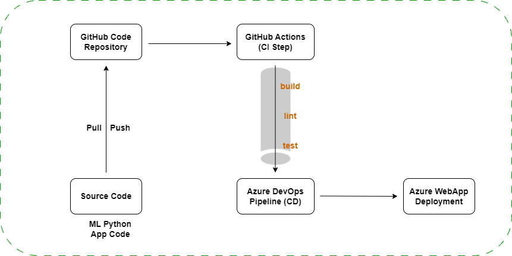
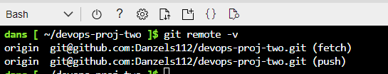
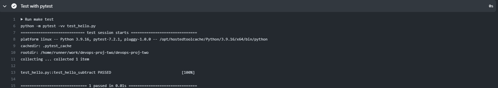
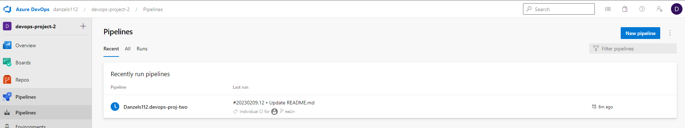
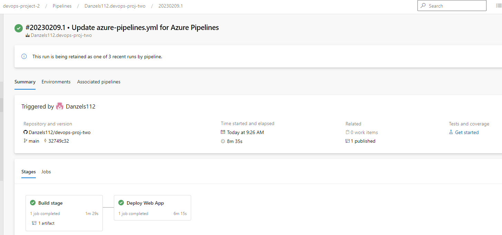
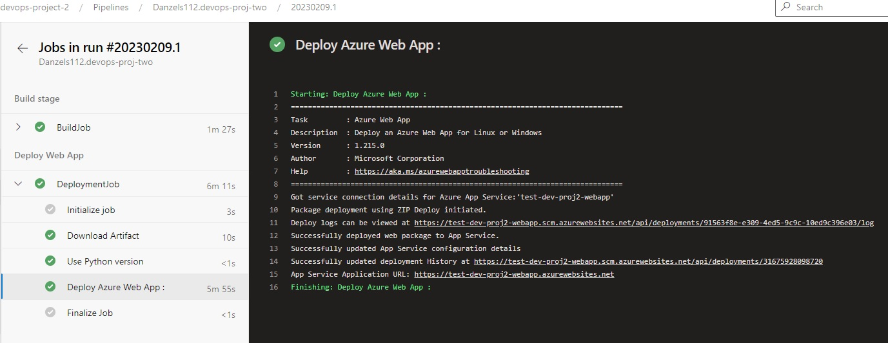
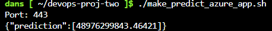

# Overview

Main target is to deploy ML Application which predicts housing prices in certain state of USA. Showcasing the use of Agile planning and how CI/CD capabilities can provide a fast and robust way to deploy application in serverless environment in automated fashion. Technology: GitHub, GitHub Actions (CI), Agile, Boards, Azure, Azure DevOps, Pipelines (CD), Azure WebApp.

## Project Plan
<TODO: Project Plan

* A link to a Trello board for the project
* Project plan can be found [here](https://github.com/Danzels112/devops-proj-two/blob/main/media/CICD-PM.xlsx)

## Instructions

#### Diagram
  

<TODO:  Instructions for running the Python project.  How could a user with no context run this project without asking you for any help.  Include screenshots with explicit steps to create that work. Be sure to at least include the following screenshots:

* #### Project running on Azure App Service
  
  - In Azure Cloud, using the Cloud shell (make sure to be located in your project folder, the App Service will create artifact with curruent folder) execute:
  
  `az webapp up --name test-dev-proj2-webapp --resource-group devops-project-2 --runtime "PYTHON:3.9"`
  
  - After waiting couple minutes of deployment, and post deployment configuration (performed by Azure) we can see that our site is working:
  
    
  
  - This can also be verified in Azure Portal, under the resource group used, you should see the deployed WebApp Service as well as the plan associated with it:

    

* #### Project cloned into Azure Cloud Shell

     

* #### Passing tests that are displayed after running the `make all` command from the `Makefile` | Output of a test run

  - There are no tests available from cloned project repository and the test code is commented. This might refer to the first steps when we are just testing things out:
    

* #### Successful deploy of the project in Azure Pipelines.  [Note the official documentation should be referred to and double checked as you setup CI/CD](https://docs.microsoft.com/en-us/azure/devops/pipelines/ecosystems/python-webapp?view=azure-devops).

  - DevOps Pipeline Project is set up (linked with GitHub account):

    

* #### Running Azure App Service from Azure Pipelines automatic deployment

  - Deployment and build triggered via remote repository is successfull:

    
  
  - Post Deployment evidence providing Azure WebApp URL:

    

* #### Successful prediction from deployed flask app in Azure Cloud Shell.  [Use this file as a template for the deployed prediction](https://github.com/udacity/nd082-Azure-Cloud-DevOps-Starter-Code/blob/master/C2-AgileDevelopmentwithAzure/project/starter_files/flask-sklearn/make_predict_azure_app.sh).
The output should look similar to this:

  - Prediction of ML Model:
  
    

* #### Output of streamed log files from deployed application

> 
## Enhancements

  - Forked code from provided repository should be checked after the fork, as we can see that for example Python 3.7 is used as basis for our deployment, however at certain point Security patches to this version will not be supported anymore. If application runs on higher versions of Python, like in this case Python 3.9, then it can be used. (This comment also applies to othe module requirements specified)
  - Source code in app.py should be checked, not all of it functional at this time (check ML models).
  - It is possible to deploy application to Azure WebApp via GitHub Actions directly, in real scenario, Azure Pipeline step creates additional complexity and introduces additional costs.
  - Real Application code testing could be a good improvement

## Demo 

<TODO: Add link Screencast on YouTube>
