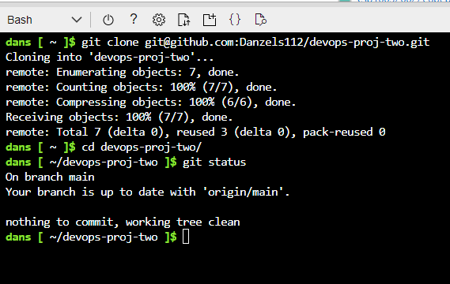
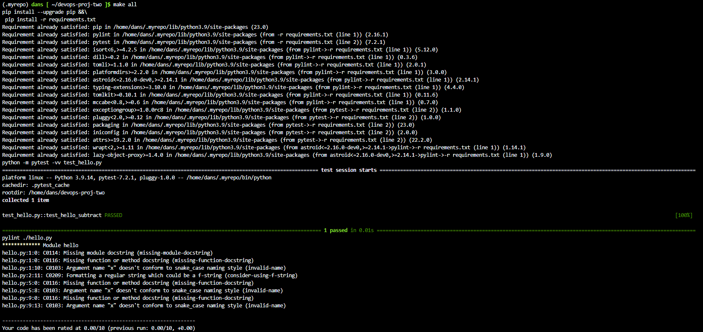
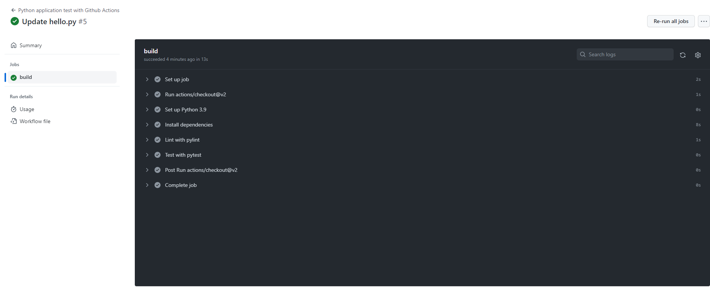

# devops-proj-two
Repo for second devops project

## Screenshots as evidence as per request in udacity instructions

Git Repository cloned to Azure (SSH key exchanged)

Makefile demonstration with functioning `make all` command

GitHub Actions passing the CI automated step

